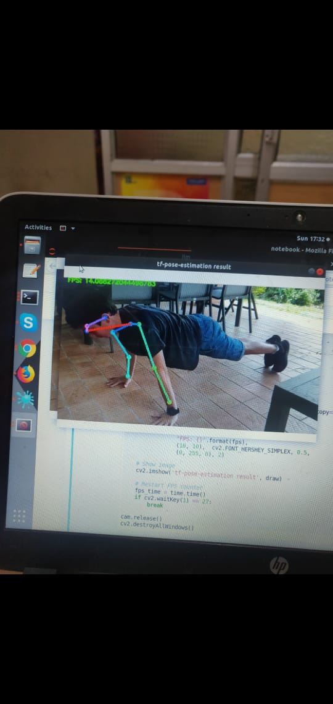
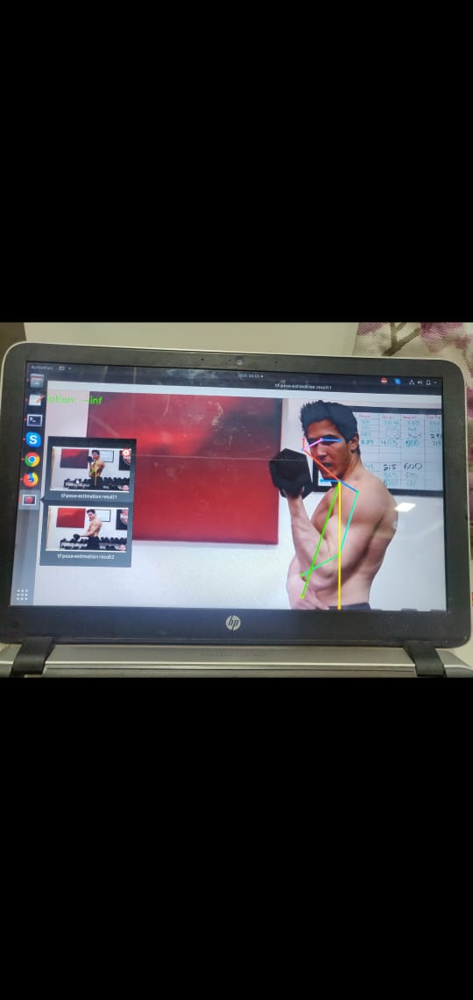

# Gym_Pose

Here, we have created a programme in which we have to gather pose of a body. Here we have use SSD MOBILENET architecture on COCO  Dataset and trained it with 140 epoch(140000 steps) and got the decent accuracy. Now to calculate the Angles, we have use basic trigonometry functions to calculate angles between keypoints

For finding angles between hip(8,11),knee(9,12), and ankle(10,13). We have applied cosine angle formula for that. Now if the angle between knee, hip and ankle is 150-160 then the user is doing great excercise.   
Now the task of designer is to design the UI in such a way that it shown the angle movement at the same position such as:
https://www.instagram.com/p/BwT9XpegHFD/

For instance, i have create serveral function in python, such as pushups, squats etc.
He has to call that function in an API and call it
**Posing exercises:

These are the keypoints of body as per the image above:

**Nose = 0
Neck = 1
RShoulder = 2
RElbow = 3
RWrist = 4
LShoulder = 5
LElbow = 6
LWrist = 7
RHip = 8
RKnee = 9
RAnkle = 10
LHip = 11
LKnee = 12
LAnkle = 13
REye = 14
LEye = 15
REar = 16
LEar = 17
Background = 18

**Pushups:

For pushup excercise, we focused on Left/RIght Shoulder, Hip, Ankle and using the following formula to calculate optimal angle.

Percentage Deviation: OptimalAngle - AngleDetected)/OptimalAngle * 100

For angle detection, we have created a function named calculate angle, which takes 3 paramters

Optimal ANgle=pi
Threshold=0.1

**Squats:***

[github-small](image/5883b82d-892b-4ecc-8b7f-43ed825accd0.jpeg)

For squats, we have taken three body parts, Left/Right Ankle, knee, hip. 
Percent Deviation:
           (OptimalAngle - AngleDetected)/OptimalAngle * 100
        Parameters:
            OptimalAngle = pi/2
            Threshold = 0.1
    - Forward knee movement
        Body Parts:
            L/R Ankle
            L/R Knee
        Percent Deviation:
           (X_ANKLE - X_KNEE)/TibiaLength * 100
        Params:
            OptimalDeviation = 0
            Threshold = TBD
    - 'Divebombing'
        Body Parts:
            L/R Shoulder
            L/R Hip
        Percent Deviation:
           (X_SHOULDER - X_HIP)/TorsoLength * 100
        Params:
            OptimalDeviation = 0
            Threshold = TBD
**Curl:**

For Curl excercie, we have taken 3 parameter, Left/RIght SHoulder, ELbow, Hip.

 Horizontal deviation in humerous to upper body:
        Body parts:
            L//R Shoulder
            L//R Elbow
            L//R Hip
        Percent Deviation:
            (OptimalAngle - AngleDetected)/OptimalAngle * 100
        Params:
            OptimalAngle = 0
            Threshold = 0.1
    """
**Acessing code on server:**
How To Access Code:
1.  Login in to your google cloud platform console
2. Select you project from the upper bar,(My First Project)
3. On the side menu bar, go to computer engine and select VM Instances
4. Click on the SSH and a terminal(SSH TERMINAL) will start
5. On that terminal and type:
	Jupyter-notebook
6. Now from your terminal console, jupyter notebook has started, but you couldn’t see
7. To access jupyter-notebook, you have to type in terminal:
      https://<IP ADDRESS OF INSTANCE(EXTERNAL)>:5000 
Here IP ADDRESS is nothing but the address written on your vm instance below internal IP
8. Now it will ask for your password, so the password is:
tdbtech4189
9. Congratulations: You have now access to your jupyter notebook.

10. Go to directory Notebooks,phormatics 
11. Inside phormatics directory, There is a file named final.py, that is the file which we will run to access everything
12. Open final.py and on the line number 38, you have to specify the path of the video file you wish to apply the model.
13. Now on the line number 288, you have to define the function (pushup, pullup, curl, squat).
14. Now save it and in order to  run the file, you have to return back to jupyter-notebook and from the new tab, on the right hand side, click on terminal and type:
	Cd Notebooks/phormatics
	Python3 final.py
15. NOw we can run our model

Next comes the connection:
How to upload video and test and where the results is saved,
1. To do that:
	-> Install filezilla on your system
	->Download the video on which you wish to run your model. 
	-> and follow this link to connect:
https://torbjornzetterlund.com/using-filezilla-google-cloud-platform-osx/
2. Now to start connection:, 
Open filezilla:
	On host(upper left)->Your Internal Ip address
username:bhindadeepanshu 

3. Once the server has been connected, you can start drag and drop of what files you need to upload.

Now to test api calls:
1. Go to final.py file
	-> To change the path of video, modify line number 38
	-> To change the type of exercise, modify line number 288
	-> To change angles of better poses, modify line number 339
*Make sure to get the video in which all the possible body key points available else it won’t detect human*

2. For instance, let’s take an example of pullup:
	->Pullup function has been defined at line number 164
	->on line number 181, 183, 185 we are defining the body keypoints i.e shoulder, elbow,ankle
	->angle is calculated on line 187 and that function has been defined in the directory,
/home/bhindadeepanshu/Notebooks,phormatics/server/helpers/calculate_angle.py
->The output video will be saved inside phormatics directory of file named outputy.avi 

**How to access code on Local:**

Our main file is phormatics.py and final.py
In order to access that
first install important libraries on your system

**pip3 install tensorflow-gpu**

**pip3 instyallopencv-python**

**pip3 install imutils**

**pip3 install tensorflow**
FIrst clone the repository,
**git clone https://github.com/jrobchin/phormatics.git**
copy **final.py** and **phormatics.py**, inside new repo folder(phormatics)
put the correct path of video in **phormatics.py**
and run**python3 phormatics.py**

